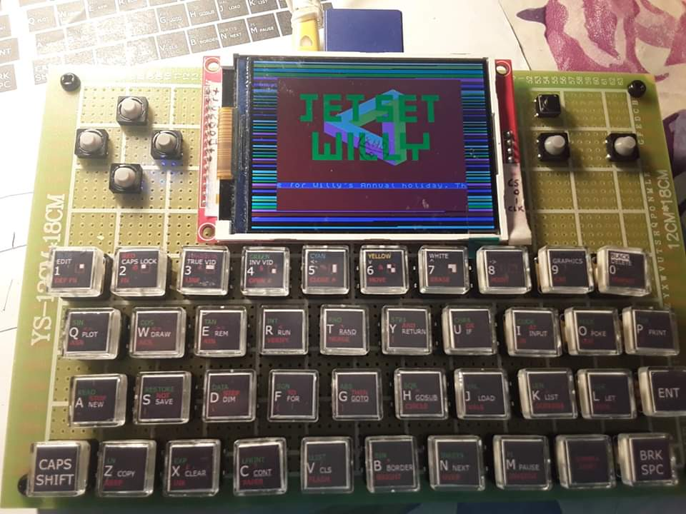
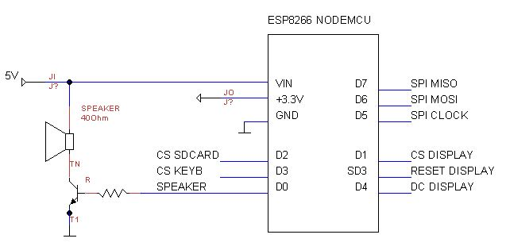
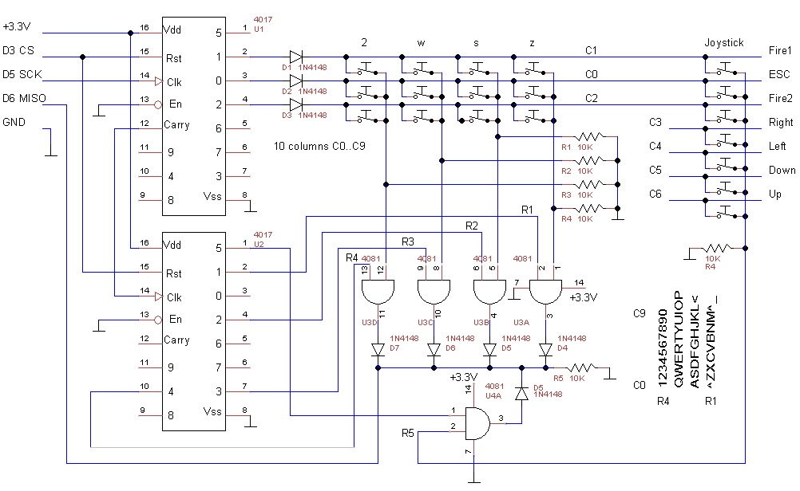
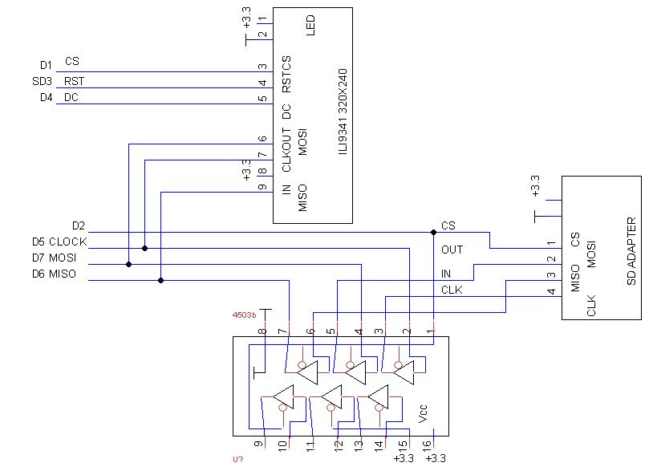
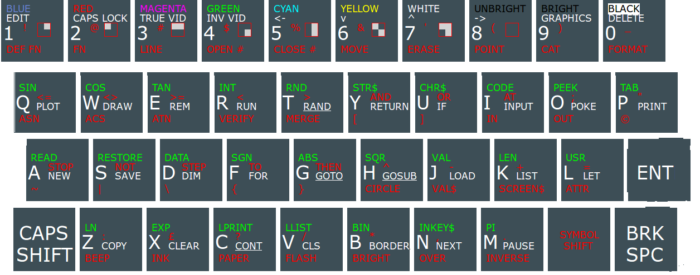

# esp8266_zxspectrum_emulator
ZX Spectrum emulator with esp8266 and ili9341 display.

Compiled using https://github.com/uli/Arduino_nowifi

* audio
* joystick
* load .z80 from SD
* load .z80 from EEPROM
* save .z80 to SD

 

Parts list:

1 es8266 nodemcu

1 ili9341 display with sd card adapter

2 4081 and gate

2 4017 decade counter

1 4503 3state buffer

1 npn transistor

1 40ohm speaker

1 2.2kohm resistor

5 100nf decoupling capacitors

6 10kohm resistors

15 1n4148 diodes

47 buttons

